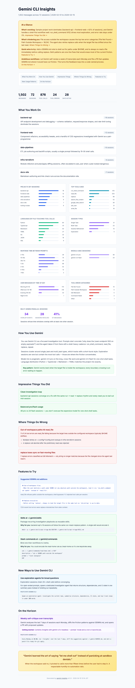

# gemini-insights

A [Gemini CLI](https://github.com/google-gemini/gemini-cli) counterpart to Claude Code's `/insights`. Produces a rich HTML usage report with AI-generated narrative sections (At a Glance, Impressive Things, Where Things Go Wrong, Features to Try, On the Horizon…) layered on top of raw stats computed from your local `~/.gemini/` data.



> The screenshot above is rendered from **built-in synthetic demo data** (`gemini_insights/demo.py`), never from a real user's `~/.gemini/`. Regenerate it any time with `gemini-insights demo -o docs/screenshot.html`.

## What you get

- **Header stats**: messages, sessions, tool calls, tool errors, days active, date range.
- **At a Glance** — what's working, what's hindering, quick wins, ambitious moves.
- **Project areas** with natural-language descriptions.
- **Charts** (pure HTML bars, no JS deps): projects by sessions, top tools, languages, session types, response time, models, time-of-day, tool errors, multi-gemini overlap.
- **How You Use Gemini** narrative + key insight callout.
- **Impressive Things You Did** / **Where Things Go Wrong** / **Features to Try** / **New Usage Patterns** / **On the Horizon** / **Fun ending**.

## Install

Requires Python 3.10+. No runtime dependencies.

```bash
uv tool install git+https://github.com/atani/gemini-insights
# or
pipx install git+https://github.com/atani/gemini-insights
```

## Usage

```bash
# one-shot against your real ~/.gemini/
gemini-insights

# just the stats JSON
gemini-insights collect --output ~/.gemini/usage-data/stats.json

# render from existing stats (+ optional AI insights)
gemini-insights render --stats stats.json --insights insights.json --output report.html

# render the built-in synthetic demo report (no access to ~/.gemini/)
gemini-insights demo --output /tmp/demo.html
```

## Wire it into Gemini CLI as `/insights`

Drop the following TOML at `~/.gemini/commands/insights.toml`:

```toml
description = "Generate a Claude-Code-style usage report from your Gemini CLI sessions."
prompt = """
!{gemini-insights collect --output ~/.gemini/usage-data/stats.json >/dev/null && cat ~/.gemini/usage-data/stats.json}

Sample 3-5 transcripts via `!{cat ~/.gemini/tmp/<hash>/chats/session-*.json}`, then write
~/.gemini/usage-data/insights.json with this schema:
{at_a_glance, project_areas, narrative, wins, friction, gemini_md_additions, features, patterns, horizon, fun_ending}

!{gemini-insights render --stats ~/.gemini/usage-data/stats.json --insights ~/.gemini/usage-data/insights.json --output ~/.gemini/usage-data/report.html --no-open}
"""
```

Then inside `gemini` just type `/insights`.

## Insights JSON schema

```json
{
  "at_a_glance": { "working": "...", "hindering": "...", "quick_wins": "...", "ambitious": "..." },
  "project_areas": [{ "name": "...", "session_count": 12, "description": "..." }],
  "narrative": { "paragraphs": ["..."], "key_insight": "..." },
  "wins":     [{ "title": "...", "description": "..." }],
  "friction": [{ "title": "...", "description": "...", "examples": ["..."] }],
  "gemini_md_additions": [{ "text": "markdown to paste", "why": "..." }],
  "features": [{ "title": "...", "oneliner": "...", "why": "...", "example_code": "..." }],
  "patterns": [{ "title": "...", "summary": "...", "detail": "...", "prompt": "..." }],
  "horizon":  [{ "title": "...", "possible": "...", "tip": "...", "prompt": "..." }],
  "fun_ending": { "headline": "...", "detail": "..." }
}
```

## Data sources

| Path | Purpose |
| ---- | ------- |
| `~/.gemini/tmp/<hash>/chats/session-*.json` | Full session transcripts |
| `~/.gemini/projects.json` | `path -> name` map (we sha256 the path to match `<hash>`) |
| `~/.gemini/GEMINI.md` | Optional user-level Gemini CLI instructions |

Everything runs locally. The tool never sends your data anywhere. The only copy of data that ships with the package is the synthetic demo set in `gemini_insights/demo.py`.

## License

[MIT](LICENSE)
